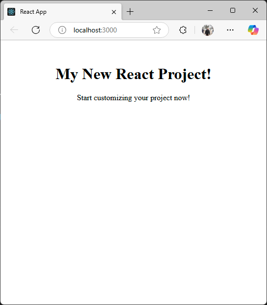

# MyReact Project



## Overview

**MyReact Project** is a lightweight and modern React project setup with Webpack and Babel. This project serves as a starting template for building React applications with a custom Webpack configuration, ensuring optimized builds and an efficient development workflow.

## Features

- **React 19** with the latest hooks and functional components.
- **Webpack 5** for bundling and development server support.
- **Babel** for JavaScript transpilation.
- **ESLint & Prettier** (recommended) for code quality and formatting.
- **CSS & Image Support** using loaders in Webpack.
- **MIT License** for open-source contribution.

## Directory Structure

```
├── tameronline-myreact/
    ├── README.md
    ├── LICENSE
    ├── index.html
    ├── package.json
    ├── webpack.config.js
    ├── .babelrc
    ├── img/
    └── src/
        ├── App.js
        └── index.js
```

## Installation

To set up and run the project locally, follow these steps:

### 1. Clone the repository:
```sh
git clone https://github.com/TamerOnLine/tameronline-myreact.git
cd tameronline-myreact
```

### 2. Install dependencies:
```sh
npm install
```

### 3. Run the development server:
```sh
npm start
```
This will start a development server at `http://localhost:3000/`.

### 4. Build for production:
```sh
npm run build
```
This will generate the optimized build files in the `dist/` directory.

## Configuration

### Webpack Configuration (`webpack.config.js`)
The Webpack configuration supports:
- JavaScript and JSX files processing with Babel.
- CSS and image handling using appropriate loaders.
- HTML template generation for automatic index file creation.
- Development server setup for live reloading.

### Babel Configuration (`.babelrc`)
The Babel setup includes:
```json
{
    "presets": ["@babel/preset-env", "@babel/preset-react"]
}
```
This ensures that modern JavaScript and React JSX syntax are properly transpiled.

## Contributing

Contributions are welcome! Feel free to fork the repository and submit a pull request with improvements.

## License

This project is licensed under the [MIT License](LICENSE).

## Contact

For any questions or support, feel free to reach out to me via:
- **Website**: [tameronline.com](https://www.tameronline.com/)
- **GitHub**: [TamerOnLine](https://github.com/TamerOnLine)
- **LinkedIn**: [TamerOnline](https://www.linkedin.com/in/tameronline/)
